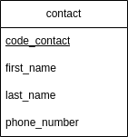

1-  npm init -y

2- npm i express dotenv

3- création du .gitignore

4- index.js ,  fichier de lancement de mon app

5- création de la structure des dossiers

6- création du router

7- mise en place controller/view

8- MCD

9- Initialisation de notre BDD